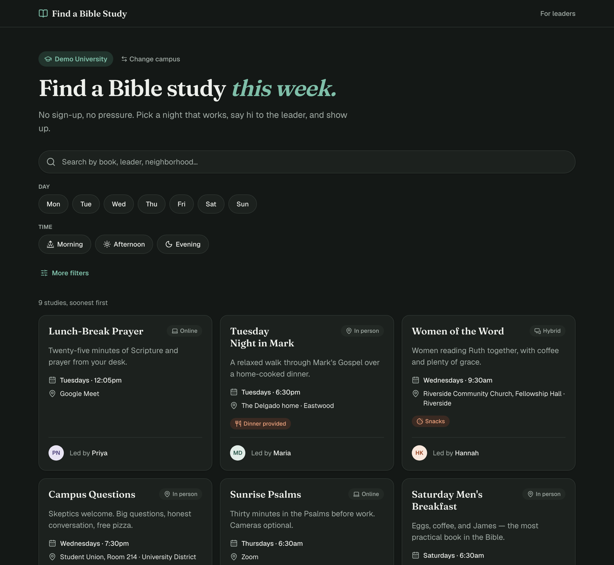
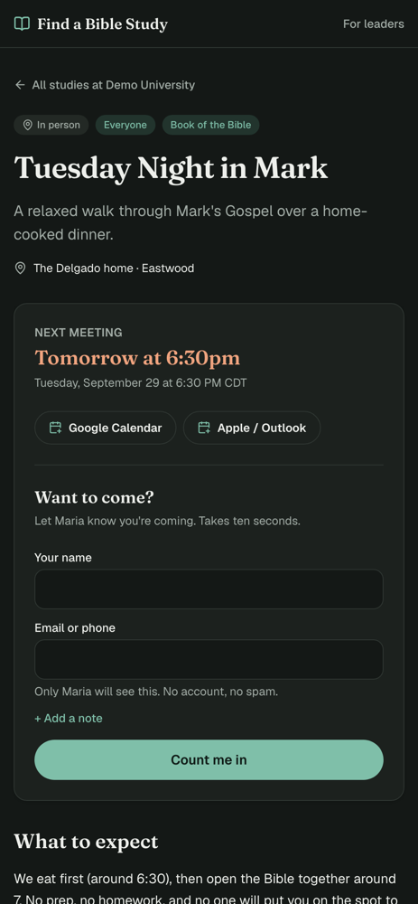
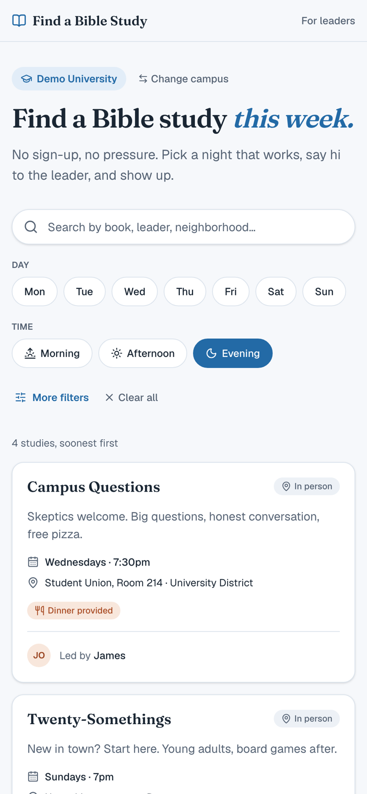

# Find a Bible Study

A campus Bible study directory where students find a study and join it in about ten seconds, with no account. Leaders get a dashboard to post their study and follow up with the people who want to come.

**Live:** [findabiblestudy.org](https://findabiblestudy.org) · Built by Jacob Qubain



## Why

Finding a Bible study on campus usually means a club fair table, a stale group chat, or a sign-up form nobody follows up on. Every extra step (an account, a password, a long form) is a reason not to go. This app removes those steps for students, and gives leaders a simple way to reach everyone who shows interest.

## Features

**Students**
- Pick your campus once; the site remembers it. Each campus has its own shareable page, like [findabiblestudy.org/tulsa-university](https://findabiblestudy.org/tulsa-university).
- Filter by day, time of day, who it's for, focus, format, and area. Filters live in the URL, so a filtered list can be shared.
- Each study shows when it meets next ("Tomorrow at 6:30pm"), what to expect, and who leads it.
- Join with just a name and an email or phone number. The exact address or video link is revealed on joining, not published.
- Add it to Google Calendar, or Apple/Outlook (a recurring `.ics` invite), or text the leader directly.
- Nothing fits? Say when you're free, and the campus's missionaries get it.

**Leaders**
- Sign in with an emailed link; there are no passwords.
- Post, edit, pause, and delete studies.
- Get an email for every new person, and reply straight to them.
- See everyone who reached out, track their status, and text, call, or email them in one tap.
- Export people to phone contacts (`.vcf`) or a spreadsheet (`.csv`), or copy all numbers to start a group chat.

**Campus missionaries**
- See everyone who couldn't find a study, and a days × times grid of when they're free, next to when studies already meet. Tap a time to see who's free then, to invite them somewhere or start a new study.

**Admins**
- Approve new leaders before their studies go public, which keeps spam out.
- Add campuses and choose each campus's contacts.

<p>
  
  &nbsp;
  
</p>

*Screenshots use the built-in sample data.*

## Tech stack

| | |
|---|---|
| App | Next.js 16 (App Router, Server Components, Server Actions), React 19, TypeScript |
| Styling | Tailwind CSS v4, Lucide icons; mobile-first with light and dark themes |
| Database & auth | Supabase: PostgreSQL with row-level security, passwordless email sign-in |
| Email | Resend, from a verified custom domain |
| Validation | Zod |
| Hosting | Vercel, deploying automatically from `main`; Vercel Web Analytics |

## Engineering highlights

- **Access control lives in the database.** Postgres row-level security and column-level privileges decide what visitors, leaders, and admins can read and write. Leaders can only touch their own studies and can't approve themselves. Addresses and meeting links sit in a separate table that only the study's leaders can read. Visitors join through a single database function that validates the request, rate-limits it, and returns the private details. See [the migrations](supabase/migrations/).
- **The security rules are tested.** `npm run test:db` applies every migration to an in-memory Postgres ([PGlite](https://pglite.dev)) and runs 60 checks of what each role can and can't do ([supabase/tests/rls.test.mjs](supabase/tests/rls.test.mjs)).
- **Schedules handle time zones correctly.** Studies are stored as local wall-clock times per campus. The next meeting is computed across daylight-saving changes, handles every-other-week studies, and never lands before the first meeting ([lib/schedule.ts](lib/schedule.ts)). Calendar invites use recurring events ([lib/calendar.ts](lib/calendar.ts)).
- **Joining never waits on anything else.** The leader's notification email is sent after the response goes back, using Next's `after()`, so a slow email service can't slow the visitor down ([lib/notify.ts](lib/notify.ts)).
- **User input is treated as untrusted.** Visitor text is HTML-escaped in emails. Spreadsheet exports neutralize anything that could run as a formula. A hidden honeypot field catches form bots. Sign-in redirects only allow same-site paths.
- **It runs with zero setup.** Without Supabase credentials, the app falls back to bundled sample data, so `npm run dev` works right after cloning.

## Running locally

```bash
git clone https://github.com/Jacob-Qubain/bible-study-directory.git
cd bible-study-directory
npm install
npm run dev          # http://localhost:3000, using sample data
npm run test:db      # database security tests
```

To connect a real database, copy `.env.example` to `.env.local` with your Supabase project's URL and keys. Then apply `supabase/migrations/` in order (with `supabase db push` or the SQL editor), and optionally `supabase/seed.sql`. `.env.example` also documents the optional Resend settings for email.

## Project structure

```
app/
  page.tsx                 Campus picker
  [campus]/                A campus's directory
  studies/[slug]/          Study page, join form, calendar invite
  leader/                  Sign-in, dashboard, study editor, people, admin
components/                Directory, filters, cards, form controls
lib/                       Data access, schedules, filters, email, auth helpers
supabase/                  Migrations, seed data, security tests
proxy.ts                   Session refresh and sign-in guard for /leader
```

The roadmap and design notes are in [docs/PLAN.md](docs/PLAN.md).
